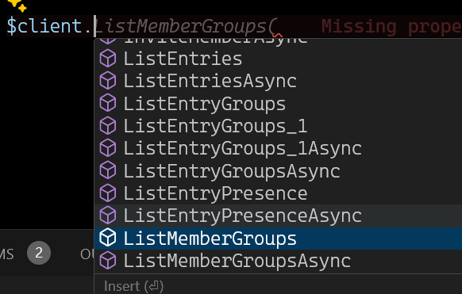
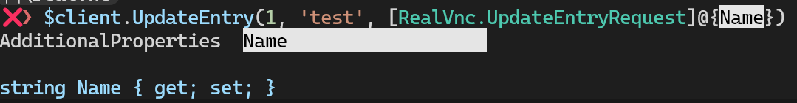
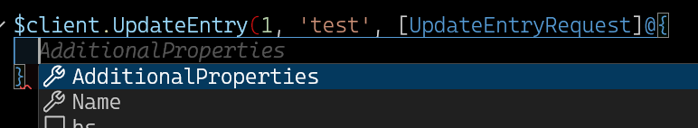

# RealVnc PowerShell Client

This is a autogenerated API client for the RealVnc Cloud API using NSwag.

Because it is a typed client, the client fully supports intellisense and all return types have intellisense. See the module source for examples of how the functions use the client.

## Getting Started

This module requires PowerShell 7.2+

```powershell
Install-PSResource RealVnc
$client = Connect-RVnc #Use API Key ID as username and API Key as password

Get-RvncEntry
Get-RVncEntryGroup | ft name,id,lastmodifiedat

#Name       Id                  LastModifiedAt
#----       --                  --------------
#TestGroup1 w7DGS4LY31meY5np8WS  1738826388324
#TestGroup2 CuMGSJwxwch84WDwQh5  1738826394309

#Use other methods, ignore the Async ones for PowerShell
#$client.<ctrl+space>
$client.ListEntries()
```

Intellisense also works in vscode for the client


For methods that have bodies, you can use the type and a hashtable to get intellisense. This works in vscode too




The module is also thread-safe and the default login context persists across runspaces, so it can be used with `Foreach-Object -Parallel`

```
❯ 1..10 |% -parallel {Get-RvncEntryGroup} | ft name,id

Name       Id
----       --
TestGroup1 w7DGS4LY31meY5np8WS
TestGroup2 CuMGSJwxwch84WDwQh5
TestGroup1 w7DGS4LY31meY5np8WS
TestGroup2 CuMGSJwxwch84WDwQh5
TestGroup1 w7DGS4LY31meY5np8WS
TestGroup2 CuMGSJwxwch84WDwQh5
TestGroup1 w7DGS4LY31meY5np8WS
TestGroup2 CuMGSJwxwch84WDwQh5
TestGroup1 w7DGS4LY31meY5np8WS
TestGroup2 CuMGSJwxwch84WDwQh5
TestGroup1 w7DGS4LY31meY5np8WS
TestGroup2 CuMGSJwxwch84WDwQh5
TestGroup1 w7DGS4LY31meY5np8WS
TestGroup2 CuMGSJwxwch84WDwQh5
TestGroup1 w7DGS4LY31meY5np8WS
TestGroup2 CuMGSJwxwch84WDwQh5
TestGroup1 w7DGS4LY31meY5np8WS
TestGroup2 CuMGSJwxwch84WDwQh5
TestGroup1 w7DGS4LY31meY5np8WS
TestGroup2 CuMGSJwxwch84WDwQh5
```


## Building the Module

You need NSwag installed, recommend using the MSI to install. Then just run `.\build.ps1` and the module will be available in the `dist` directory.
