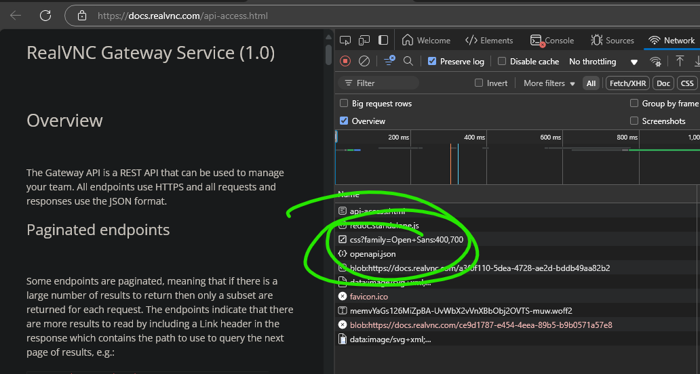

# RealVnc PowerShell Client

This is a autogenerated API client for the RealVnc Cloud API using NSwag.

Because it is a typed client, the client fully supports intellisense and all return types have intellisense. See the module source for examples of how the functions use the client.

## Getting Started

This module requires PowerShell 7.2+

```powershell
Install-PSResource RealVnc
$client = Connect-RVnc #Use API Key ID as username and API Key as password

Get-RvncEntry
Get-RVncEntryGroup | ft name,id,lastmodifiedat

#Name       Id                  LastModifiedAt
#----       --                  --------------
#TestGroup1 w7DGS4LY31meY5np8WS  1738826388324
#TestGroup2 CuMGSJwxwch84WDwQh5  1738826394309

#Use other methods, ignore the Async ones for PowerShell
#$client.<ctrl+space>
$client.ListEntries()
```

Intellisense also works in vscode for the client


For methods that have bodies, you can use the type and a hashtable to get intellisense. This works in vscode too


The module is also thread-safe and the default login context persists across runspaces, so it can be used with `Foreach-Object -Parallel`

```
❯ 1..10 |% -parallel {Get-RvncEntryGroup} | ft name,id

Name       Id
----       --
TestGroup1 w7DGS4LY31meY5np8WS
TestGroup2 CuMGSJwxwch84WDwQh5
TestGroup1 w7DGS4LY31meY5np8WS
TestGroup2 CuMGSJwxwch84WDwQh5
TestGroup1 w7DGS4LY31meY5np8WS
TestGroup2 CuMGSJwxwch84WDwQh5
TestGroup1 w7DGS4LY31meY5np8WS
TestGroup2 CuMGSJwxwch84WDwQh5
TestGroup1 w7DGS4LY31meY5np8WS
TestGroup2 CuMGSJwxwch84WDwQh5
TestGroup1 w7DGS4LY31meY5np8WS
TestGroup2 CuMGSJwxwch84WDwQh5
TestGroup1 w7DGS4LY31meY5np8WS
TestGroup2 CuMGSJwxwch84WDwQh5
TestGroup1 w7DGS4LY31meY5np8WS
TestGroup2 CuMGSJwxwch84WDwQh5
TestGroup1 w7DGS4LY31meY5np8WS
TestGroup2 CuMGSJwxwch84WDwQh5
TestGroup1 w7DGS4LY31meY5np8WS
TestGroup2 CuMGSJwxwch84WDwQh5
```

## Building the Module

You need NSwag installed, recommend using the MSI to install. Then just run `.\build.ps1` and the module will be available in the `dist` directory.

## How I built this

1. [OpenAPI](https://www.openapis.org/) (formerly Swagger) is a standard for describing a REST API that is becoming increasingly popular.
1. RealVNC publishes their [API docs here](https://docs.realvnc.com/api-access.html), when they have a look and feel like this, it's a telltale sign it's an autogenerated doc site, sure enough F12 Devtools reveals the openapi JSON specification

1. I fetched the JSON, and converted it to YAML because I find it easier to work with for complicated docs like this (JSON is directly convertible to YAML and OpenAPI supports both formats)
1. There are 4 major OpenAPI generators as of 2025 in use that I am aware of: [autorest](https://github.com/Azure/autorest.powershell), [kiota](https://learn.microsoft.com/en-us/openapi/kiota/overview), [openapi-generator](https://github.com/OpenAPITools/openapi-generator) and [nswag](https://github.com/RicoSuter/NSwag). All have strengths and weaknesses, I chose nswag because it generates a dependency-less single C# source file for simplicity.
1. Ran `dotnet new classlib` to create a new project
1. Created an NSwag configuration and ran it to generate the base client.
1. NSwag has no native support for authentication, you have to roll your own, which is commmon as there isn't really a standard for API access (though OAuth and Bearer tokens are quickly becoming de-facto). To do that, you kind of need to know C#, there is a concept of [partial classes](https://learn.microsoft.com/en-us/dotnet/csharp/programming-guide/classes-and-structs/partial-classes-and-methods) which lets you define the guts of a class across multiple files, which is perfect for these scenarios where one part of the code is hand-written and one part of the code is autogenerated.
1. All generators are different, but nswag has built-in "hooks" for this in the form of some partial delegates that are undefined in the autogenerated sheet and can be overridden, which are `Initialize`, `PrepareRequest`, and `ProcessResponse`, which basically let you inject "middleware" into the API call process. Everything is just a fancy wrapper on top of HttpClient in the end. **Figuring the authentication out is the hardest part in most API generators, the docs are usually very obtuse on this point**
1. In order to supply the API key, I decided I wanted to write the main logic in PowerShell, so the only details I put into the C# client was that the bearer token would be provided, and then appended to outgoing requests, so that we can do the auth work in PowerShell and simply supply it to the client when we create it. This isn't ideal as the token will expire so this module would need to be re-connected for long-running processes when the token expires, and it would be better to have logic to refresh the token when it expires, but it's good enough for basics.
1. I also added a static class with a static property as that is as close to a "global" that exists in PowerShell, and something that works across runspaces. This allows us to store the client in a place that is accessible process-wide, such that you can very simply use parallel runspaces to do activities without having to pass a client object around. However, we still allow that to happen in the weird case you need multiple clients (A good example of this would be connecting with different users to do multiple separate tasks across different logins/tenants)
1. After that the PowerShell is pretty straightforward, and if you import the assembly ahead of time, you get intellisense for all the autogenerated methods on the client.

## Quick 2025 thoughts on available generators
1. `openapi-generator` will generate an all-powershell module, but I don't like the existing approach, maybe I'll write a better templater someday
1. `kiota` is the new hotness, but it's very painful to work with, it's been made more extensible lately, but still difficult to customize with very little helpful documentation in that area. Only generates C#
1. `autorest.powershell` generates binary cmdlets for PowerShell, which is great and is what the Az and Graph cmdlets use to generate their commands from autorest spec, but I just wanted someting a little more bespoke for this module and it also generates a TON of "noise" documents.
1. nswag produces the most modern-looking code, simple, concise, support for System.Text.Json, overall excellent code that is easy to read, but it produces c# only so you're on your own to make the "UI" of PowerShell Cmdlets or functions.